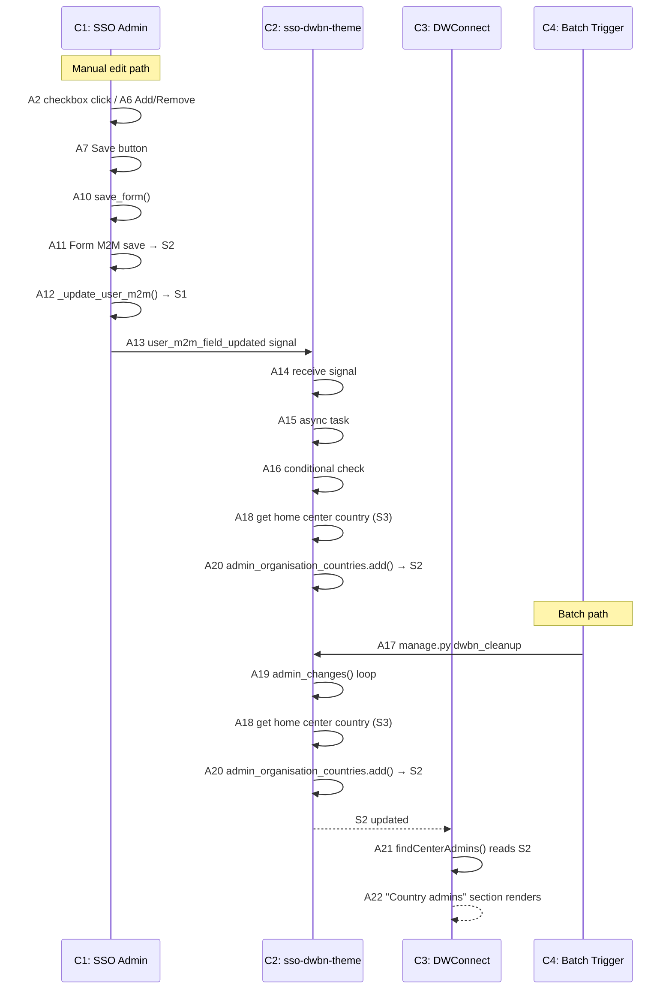
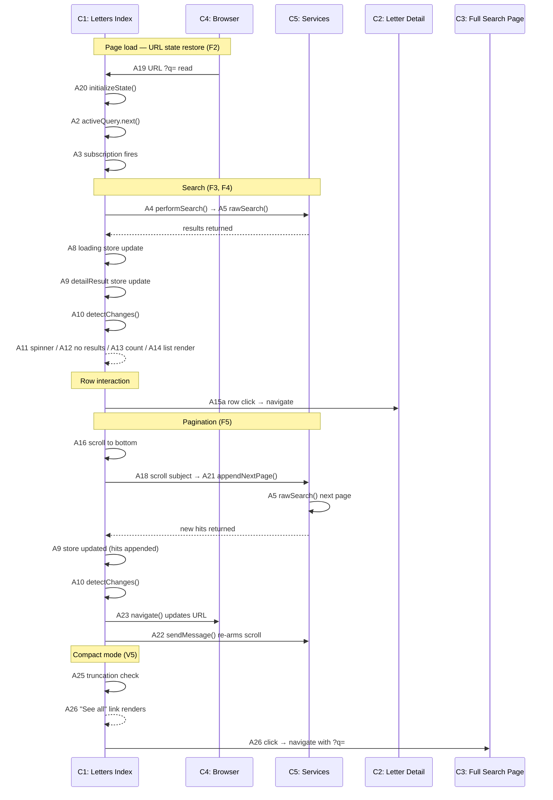

# Breadboarding Examples

## Contents

- Example A: Mapping an existing system
- Example B: Designing from shaped parts

## Example A: Mapping an Existing System

**Goal:** Understand how `admin_organisation_countries` gets modified and read across three entry points: a manual edit in SSO Admin, a checkbox toggle, and a scheduled batch job.

### Context List

| # | Context | Description |
|---|---|---|
| C1 | SSO Admin — User Change Page | Where an admin edits a user's role and country assignments |
| C2 | sso-dwbn-theme | Background processing layer that reacts to user changes |
| C3 | DWConnect — Center Page | Where country admin assignments are displayed |
| C4 | Batch Trigger | Scheduled `manage.py dwbn_cleanup` job |

### Actions Reference

- **A1** – `role_profiles` checkboxes (UI): renders the user's current role profiles
- **A2** – "Country Admin" checkbox (UI): click toggles the Country Admin role; leads to A7
- **A3** – `admin_countries` filter (UI): renders the country assignment widget (superuser only, shown by A9)
- **A4** – Available countries list (UI): renders countries the user could be assigned
- **A5** – Selected countries list (UI): renders countries already assigned; fed by S2
- **A6** – Add → / Remove ← (UI): click modifies the selection in A5; leads to A7
- **A7** – Save button (UI): click triggers A10
- **A8** – `get_administrable_user_countries()` (System): returns the list of assignable countries; feeds A4
- **A9** – `get_fieldsets()` (System): conditionally shows A3 for superusers
- **A10** – `save_form()` (System): triggers A11 and A12
- **A11** – Form M2M save (System): Django's built-in M2M handler; writes to S2
- **A12** – `_update_user_m2m()` (System): updates S1; fires signal A13
- **A13** – `user_m2m_field_updated` signal (System): received by A14
- **A14** – `dwbn_user_m2m_field_updated()` (System): receives the signal; triggers A15
- **A15** – `dwbn_user_m2m_field_updated_task()` (System): async task; triggers A16
- **A16** – Country Admin added AND zero admin countries? (System): conditional; if yes, triggers A18
- **A17** – `manage.py dwbn_cleanup` (System): batch job; triggers A19
- **A18** – Get home center's country (System): triggers A20
- **A19** – `admin_changes()` (System): loops over Country Admins; for each missing home center country, triggers A18
- **A20** – `admin_organisation_countries.add()` (System): writes to S2
- **A21** – `findCenterAdmins()` (System): reads S2; feeds A22
- **A22** – "Country admins" section (UI): renders the list of country admins in DWConnect
- **S1** – `role_profiles` (Data Store): M2M — which role profiles a user has
- **S2** – `admin_organisation_countries` (Data Store): M2M — which countries a user administers
- **S3** – `organisations` (Data Store): user's home centre(s)

### Sequence Diagram

## Example B: Designing from Shaped Parts

### Part 1: What Comes In from the Design Phase

**Requirements**

| ID | Requirement |
|---|---|
| R0 | Make content searchable from the index page |
| R2 | Navigate back to pagination state when returning from detail |
| R3 | Navigate back to search state when returning from detail |
| R4 | Search/pagination state survives page refresh |
| R5 | Browser back button restores previous search/pagination state |
| R9 | Search should debounce input (not fire on every keystroke) |
| R10 | Search should require minimum 3 characters |
| R11 | Loading and empty states should provide user feedback |

**Existing Patterns to Reuse**

| Part | Mechanism |
|---|---|
| S-CUR1 | URL state & initialisation |
| S-CUR2 | Search input (debounce, min 3 chars) |
| S-CUR3 | Data fetching |
| S-CUR4 | Pagination (scroll-to-bottom, append pages) |
| S-CUR5 | Rendering (loading, empty, results list) |

**New Parts**

| Part | Mechanism | Adapts |
|---|---|---|
| F1 | Create widget (component, definition, register) | — |
| F2 | URL state & initialisation (read `?q=`, restore on load) | S-CUR1 |
| F3 | Search input (debounce, min 3 chars, triggers search) | S-CUR2 |
| F4 | Data fetching (`rawSearch()` with filter) | S-CUR3 |
| F5 | Pagination (scroll-to-bottom, append pages, re-arm) | S-CUR4 |
| F6 | Rendering (loading, empty, results list, rows) | S-CUR5 |

### Part 2: The Breadboard

#### Context List

| # | Context | Description |
|---|---|---|
| C1 | Letters Index Page | The page containing the letter-browser widget |
| C2 | Letter Detail Page | Individual letter view |
| C3 | Full Search Page | Full-page search results |
| C4 | Browser | URL state and back button |
| C5 | Services | typesense.service and intercom.service |

#### Actions Reference

- **A1** – search input (UI): user types a query; triggers A2
- **A2** – `activeQuery.next()` (System): pushes query into the observable stream; triggers A3; feeds A14 (compact link)
- **A3** – `activeQuery` subscription (System): observes stream with 90ms debounce, min 3 chars; triggers A4
- **A4** – `performSearch()` (System): sets loading state, calls search service; triggers A5, A8, A9, A10
- **A5** – `rawSearch()` (System): queries Typesense with filter from A17; returns `{found, hits}` to A4 and A12
- **A6** – `parentId` config (System): filter value fed into A5
- **A7** – `compact` config (System): controls pagination subscription (A15), truncation logic (A16), and search filter (A5)
- **A8** – `loading` store (System): written by A4; feeds A10
- **A9** – `detailResult` store (System): written by A4; feeds A10 and A16
- **A10** – `detectChanges()` (System): triggers re-render; triggers A11, A12, A13, A14 display
- **A11** – loading spinner (UI): renders while A8 is true
- **A12** – no results message (UI): renders when A9 is empty
- **A13** – result count (UI): renders count from A9
- **A14** – results list (UI): renders rows A15a-A15d from A9
- **A15a** – row click (UI): click navigates to C2
- **A15b** – date (UI): renders letter date
- **A15c** – subject (UI): renders letter subject
- **A15d** – teaser (UI): renders letter teaser
- **A16** – scroll (UI): scroll to bottom triggers A18
- **A17** – back button (UI): click reads A19
- **A18** – intercom scroll subject (System): observes scroll; triggers A12 (`appendNextPage()`)
- **A19** – URL `?q=` (System): reads query param; triggers A20
- **A20** – `initializeState()` (System): restores query and triggers A2 and A4 on load
- **A21** – `appendNextPage()` (System): increments page, calls A5, updates A9, triggers A10, calls A22 and A23
- **A22** – `sendMessage()` (System): re-arms A18 for next scroll
- **A23** – `navigate()` (System): updates A19 (browser URL)
- **A24** – if `!compact` subscribe (System): conditionally arms A18 based on A7
- **A25** – if truncated show link (System): conditionally shows A26 based on A9 and A7
- **A26** – "See all X results" link (UI): click navigates to C3 with `?q=` from A2; shown when A25 fires; fed by A18 (`fullPageRoute` config)

#### Sequence Diagram

#### Slicing

| # | Slice | Mechanism | Actions in Flow | Demo |
|---|---|---|---|---|
| V1 | Widget with real data | F1, F4, F6 | A4-A15d | "Widget shows real letters from API" |
| V2 | Search works | F3 | A1, A2, A3 | "Type 'dharma', results filter live" |
| V3 | Infinite scroll | F5 | A16, A18, A21, A22 | "Scroll down, more results load" |
| V4 | URL state | F2 | A17, A19, A20, A23 | "Refresh preserves the search query" |
| V5 | Compact mode | — | A24, A25, A26 | "Shows 'See all X results' link" |
