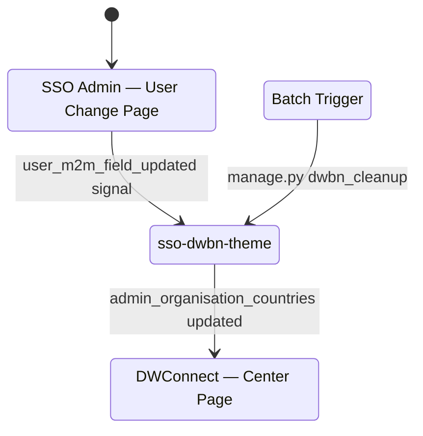
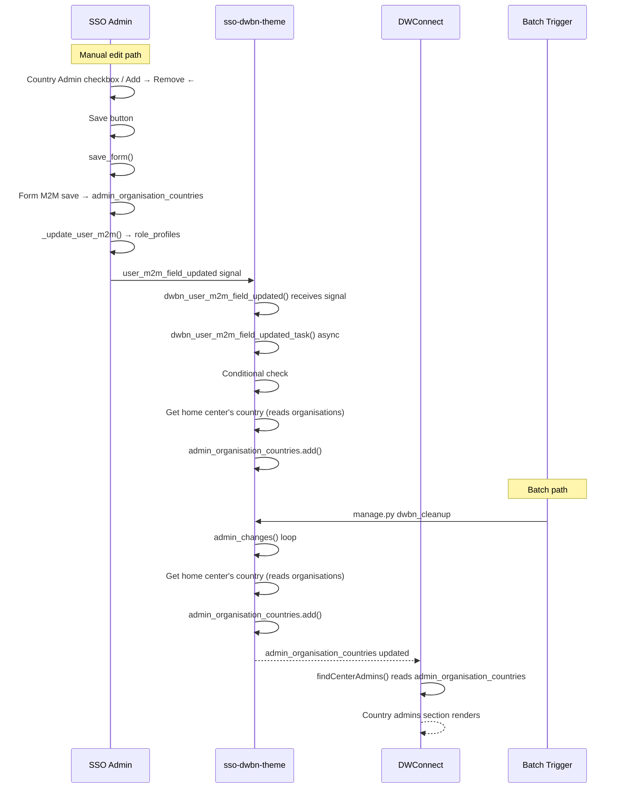
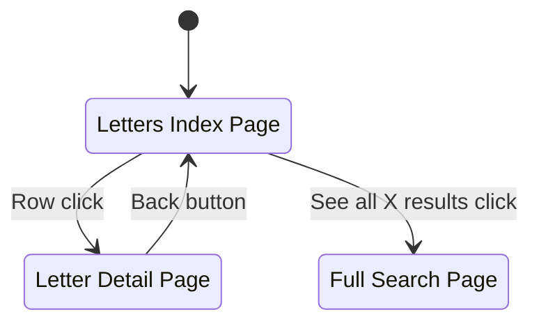
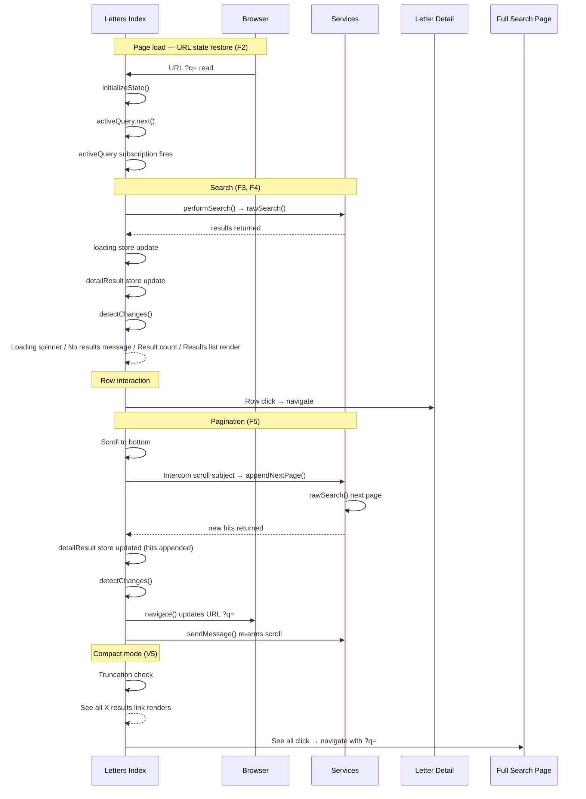

# Breadboarding Examples

## Contents

- Example A: Mapping an existing system
- Example B: Designing from shaped parts

---

## Example A: Mapping an Existing System

**Goal:** Understand how `admin_organisation_countries` gets modified and read across three entry points: a manual edit in SSO Admin, a checkbox toggle, and a scheduled batch job.

### Legend

| Type | Definition |
|---|---|
| Place | A bounded context of interaction — where you are and what you can do |
| UI | What the user sees or interacts with |
| Code | Functions and handlers you can call or observe |
| Store | State that persists and is read and written |

### Places List

| Place | Description |
|---|---|
| SSO Admin — User Change Page | Where an admin edits a user's role and country assignments |
| sso-dwbn-theme | Background processing layer that reacts to user changes |
| DWConnect — Center Page | Where country admin assignments are displayed |
| Batch Trigger | Scheduled `manage.py dwbn_cleanup` job |

### UI Table

| Name | Description | Triggers | Feeds |
|---|---|---|---|
| `role_profiles` checkboxes | Renders the user's current role profiles | | |
| Country Admin checkbox | Click toggles the Country Admin role | `save_form()` | |
| `admin_countries` filter | Renders the country assignment widget (superuser only, shown by `get_fieldsets()`) | | |
| Available countries list | Renders countries the user could be assigned | | |
| Selected countries list | Renders countries already assigned | | `admin_organisation_countries` |
| Add → / Remove ← | Click modifies the selection | `save_form()` | |
| Save button | Click submits the form | `save_form()` | |
| Country admins section | Renders the list of country admins in DWConnect | | `admin_organisation_countries` |

### Code Table

| Name | Description | Triggers | Feeds |
|---|---|---|---|
| `get_administrable_user_countries()` | Returns the list of assignable countries | | Available countries list |
| `get_fieldsets()` | Conditionally shows `admin_countries` filter for superusers | | `admin_countries` filter |
| `save_form()` | Handles form submission | Form M2M save, `_update_user_m2m()` | |
| Form M2M save | Django's built-in M2M handler | `admin_organisation_countries` | |
| `_update_user_m2m()` | Updates `role_profiles` and fires signal | `role_profiles`, `user_m2m_field_updated` signal | |
| `user_m2m_field_updated` signal | Received by `dwbn_user_m2m_field_updated()` | `dwbn_user_m2m_field_updated()` | |
| `dwbn_user_m2m_field_updated()` | Receives the signal | `dwbn_user_m2m_field_updated_task()` | |
| `dwbn_user_m2m_field_updated_task()` | Async task | Conditional check | |
| Conditional check | Country Admin added AND zero admin countries? | Get home center's country | |
| `manage.py dwbn_cleanup` | Batch job entry point | `admin_changes()` | |
| Get home center's country | Reads `organisations` | `admin_organisation_countries.add()` | |
| `admin_changes()` | Loops over Country Admins; for each missing home center country | Get home center's country | |
| `admin_organisation_countries.add()` | Writes to `admin_organisation_countries` | `admin_organisation_countries` | |
| `findCenterAdmins()` | Reads `admin_organisation_countries` | | Country admins section |

### Stores Table

| Name | Description | Written by | Feeds |
|---|---|---|---|
| `role_profiles` | M2M — which role profiles a user has | `_update_user_m2m()` | |
| `admin_organisation_countries` | M2M — which countries a user administers | Form M2M save, `admin_organisation_countries.add()` | Selected countries list, Country admins section |
| `organisations` | User's home centre(s) | | Get home center's country |

### State Diagram

This breadboard spans system Places, not user-navigated screens. The state diagram shows how processing responsibility flows between systems rather than where a user clicks.

### Sequence Diagram

---

## Example B: Designing from Shaped Parts

### Part 1: What Comes In from the Design Phase

**Requirements**

| ID | Requirement |
|---|---|
| R0 | Make content searchable from the index page |
| R2 | Navigate back to pagination state when returning from detail |
| R3 | Navigate back to search state when returning from detail |
| R4 | Search/pagination state survives page refresh |
| R5 | Browser back button restores previous search/pagination state |
| R9 | Search should debounce input (not fire on every keystroke) |
| R10 | Search should require minimum 3 characters |
| R11 | Loading and empty states should provide user feedback |

**Existing Patterns to Reuse**

| Part | Mechanism |
|---|---|
| S-CUR1 | URL state & initialisation |
| S-CUR2 | Search input (debounce, min 3 chars) |
| S-CUR3 | Data fetching |
| S-CUR4 | Pagination (scroll-to-bottom, append pages) |
| S-CUR5 | Rendering (loading, empty, results list) |

**New Parts**

| Part | Mechanism | Adapts |
|---|---|---|
| F1 | Create widget (component, definition, register) | — |
| F2 | URL state & initialisation (read `?q=`, restore on load) | S-CUR1 |
| F3 | Search input (debounce, min 3 chars, triggers search) | S-CUR2 |
| F4 | Data fetching (`rawSearch()` with filter) | S-CUR3 |
| F5 | Pagination (scroll-to-bottom, append pages, re-arm) | S-CUR4 |
| F6 | Rendering (loading, empty, results list, rows) | S-CUR5 |

### Part 2: The Breadboard

#### Legend

| Type | Definition |
|---|---|
| Place | A bounded context of interaction — where you are and what you can do |
| UI | What the user sees or interacts with |
| Code | Functions and handlers you can call or observe |
| Store | State that persists and is read and written |

#### Places List

| Place | Description |
|---|---|
| Letters Index Page | The page containing the letter-browser widget |
| Letter Detail Page | Individual letter view |
| Full Search Page | Full-page search results |
| Browser | URL state and back button |
| Services | typesense.service and intercom.service |

#### UI Table

| Name | Description | Triggers | Feeds |
|---|---|---|---|
| Search input | User types a query | `activeQuery.next()` | |
| Loading spinner | Renders while `loading` is true | | `loading` |
| No results message | Renders when `detailResult` is empty | | `detailResult` |
| Result count | Renders count from `detailResult` | | `detailResult` |
| Results list | Renders rows from `detailResult` | | `detailResult` |
| Row click | Click navigates to Letter Detail Page | Letter Detail Page | |
| Date | Renders letter date | | |
| Subject | Renders letter subject | | |
| Teaser | Renders letter teaser | | |
| Scroll | Scroll to bottom triggers pagination | `appendNextPage()` | |
| Back button | Click reads URL `?q=` to restore state | `initializeState()` | |
| See all X results link | Navigates to Full Search Page with `?q=`; shown when truncated | Full Search Page | `detailResult` |

#### Code Table

| Name | Description | Triggers | Feeds |
|---|---|---|---|
| `activeQuery.next()` | Pushes query into the observable stream | `activeQuery` subscription | See all X results link |
| `activeQuery` subscription | Observes stream with 90ms debounce, min 3 chars | `performSearch()` | |
| `performSearch()` | Sets loading state, calls search service | `rawSearch()`, `loading`, `detailResult`, `detectChanges()` | |
| `rawSearch()` | Queries Typesense with filter from `parentId` config | | `detailResult` |
| `parentId` config | Filter value fed into `rawSearch()` | | `rawSearch()` |
| `compact` config | Controls conditional subscription, truncation, and filter | If !compact subscribe, Truncation check, `rawSearch()` | |
| `detectChanges()` | Triggers re-render | Loading spinner, No results message, Result count, Results list, See all X results link | |
| Intercom scroll subject | Observes scroll; triggers `appendNextPage()` | `appendNextPage()` | |
| `initializeState()` | Restores query on load from URL `?q=` | `activeQuery.next()`, `performSearch()` | |
| `appendNextPage()` | Increments page, calls `rawSearch()`, updates `detailResult`, re-arms scroll | `rawSearch()`, `detailResult`, `detectChanges()`, `sendMessage()`, `navigate()` | |
| `sendMessage()` | Re-arms Intercom scroll subject for next scroll | Intercom scroll subject | |
| `navigate()` | Updates URL `?q=` | URL `?q=` | |
| If !compact subscribe | Conditionally arms Intercom scroll subject based on `compact` config | Intercom scroll subject | |
| Truncation check | Conditionally shows See all link based on `detailResult` and `compact` config | | See all X results link |

#### Stores Table

| Name | Description | Written by | Feeds |
|---|---|---|---|
| `loading` | Boolean loading state | `performSearch()` | Loading spinner |
| `detailResult` | Array of search result hits | `performSearch()`, `appendNextPage()` | No results message, Result count, Results list, See all X results link, Truncation check |
| URL `?q=` | Browser URL query param — persists search state across refresh and back | `navigate()` | `initializeState()` |

#### State Diagram

Note: Browser and Services are infrastructure Places that support the flow but are not states the user navigates to.

#### Sequence Diagram

#### Slicing

| Slice | Mechanism | Elements in Flow | Demo |
|---|---|---|---|
| V1 | Widget with real data | F1, F4, F6 | `performSearch()`, `rawSearch()`, `loading`, `detailResult`, `detectChanges()`, Loading spinner–Teaser | "Widget shows real letters from API" |
| V2 | Search works | F3 | Search input, `activeQuery.next()`, `activeQuery` subscription | "Type 'dharma', results filter live" |
| V3 | Infinite scroll | F5 | Scroll, Intercom scroll subject, `appendNextPage()`, `sendMessage()` | "Scroll down, more results load" |
| V4 | URL state | F2 | Back button, URL `?q=`, `initializeState()`, `navigate()` | "Refresh preserves the search query" |
| V5 | Compact mode | — | `compact` config, If !compact subscribe, Truncation check, See all X results link | "Shows 'See all X results' link" |
