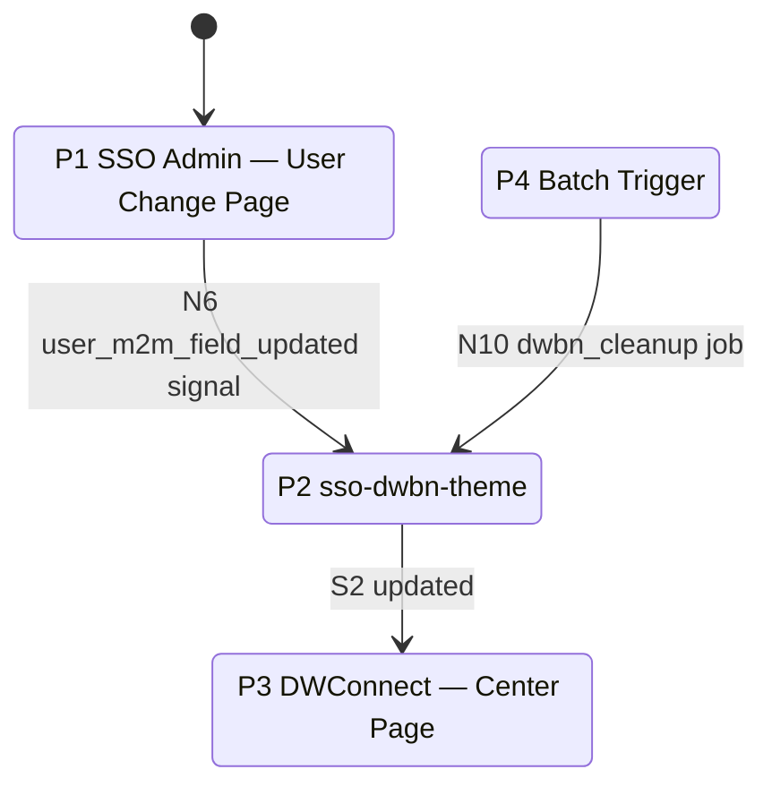
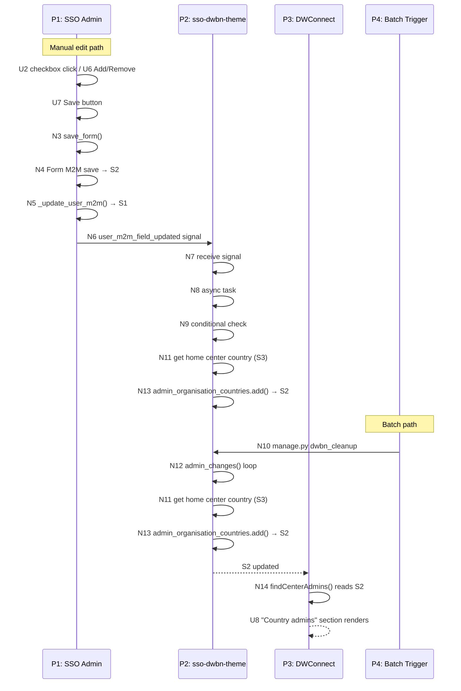
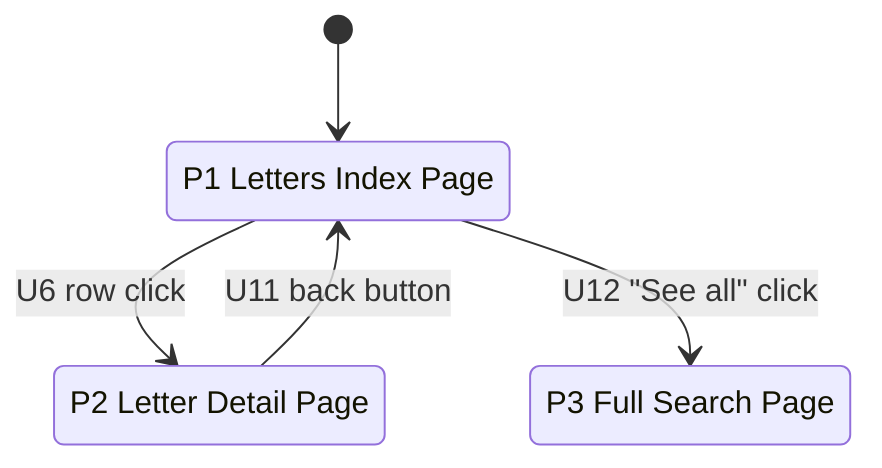
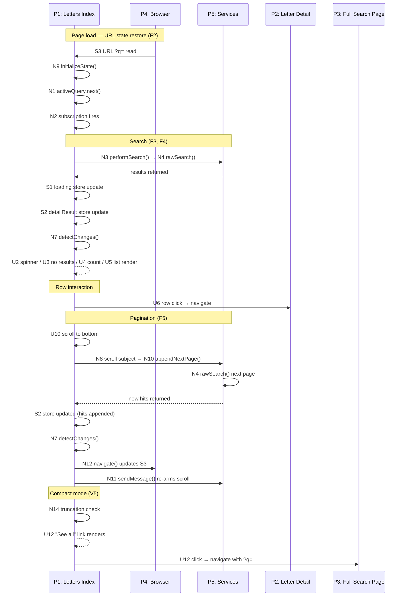

# Breadboarding Examples

## Contents

- Example A: Mapping an existing system
- Example B: Designing from shaped parts

---

## Example A: Mapping an Existing System

**Goal:** Understand how `admin_organisation_countries` gets modified and read across three entry points: a manual edit in SSO Admin, a checkbox toggle, and a scheduled batch job.

### Legend

| Prefix | Type | Definition |
|---|---|---|
| P# | Place | A bounded context of interaction — where you are and what you can do |
| U# | UI | What the user sees or interacts with |
| N# | Code | Functions and handlers you can call or observe |
| S# | Store | State that persists and is read and written |

### Places List

| # | Place | Description |
|---|---|---|
| P1 | SSO Admin — User Change Page | Where an admin edits a user's role and country assignments |
| P2 | sso-dwbn-theme | Background processing layer that reacts to user changes |
| P3 | DWConnect — Center Page | Where country admin assignments are displayed |
| P4 | Batch Trigger | Scheduled `manage.py dwbn_cleanup` job |

### UI Table

| # | Name | Description | Triggers | Feeds |
|---|---|---|---|---|
| U1 | `role_profiles` checkboxes | Renders the user's current role profiles | | |
| U2 | "Country Admin" checkbox | Click toggles the Country Admin role | N3 | |
| U3 | `admin_countries` filter | Renders the country assignment widget (superuser only, shown by N2) | | |
| U4 | Available countries list | Renders countries the user could be assigned | | |
| U5 | Selected countries list | Renders countries already assigned | | S2 |
| U6 | Add → / Remove ← | Click modifies the selection in U5 | N3 | |
| U7 | Save button | Click submits the form | N3 | |
| U8 | "Country admins" section | Renders the list of country admins in DWConnect | | S2 |

### Code Table

| # | Name | Description | Triggers | Feeds |
|---|---|---|---|---|
| N1 | `get_administrable_user_countries()` | Returns the list of assignable countries | | U4 |
| N2 | `get_fieldsets()` | Conditionally shows U3 for superusers | | U3 |
| N3 | `save_form()` | Handles form submission | N4, N5 | |
| N4 | Form M2M save | Django's built-in M2M handler | S2 | |
| N5 | `_update_user_m2m()` | Updates S1 and fires signal | S1, N6 | |
| N6 | `user_m2m_field_updated` signal | Received by N7 | N7 | |
| N7 | `dwbn_user_m2m_field_updated()` | Receives the signal | N8 | |
| N8 | `dwbn_user_m2m_field_updated_task()` | Async task | N9 | |
| N9 | Country Admin added AND zero admin countries? | Conditional check | N11 | |
| N10 | `manage.py dwbn_cleanup` | Batch job entry point | N12 | |
| N11 | Get home center's country | Reads S3 | N13 | |
| N12 | `admin_changes()` | Loops over Country Admins; for each missing home center country triggers N11 | N11 | |
| N13 | `admin_organisation_countries.add()` | Writes to S2 | S2 | |
| N14 | `findCenterAdmins()` | Reads S2 | | U8 |

### Stores Table

| # | Name | Description | Written by | Feeds |
|---|---|---|---|---|
| S1 | `role_profiles` | M2M — which role profiles a user has | N5 | |
| S2 | `admin_organisation_countries` | M2M — which countries a user administers | N4, N13 | U5, U8 |
| S3 | `organisations` | User's home centre(s) | | N11 |

### State Diagram

This breadboard spans system Places, not user-navigated screens. The state diagram shows how processing responsibility flows between systems rather than where a user clicks.

### Sequence Diagram

---

## Example B: Designing from Shaped Parts

### Part 1: What Comes In from the Design Phase

**Requirements**

| ID | Requirement |
|---|---|
| R0 | Make content searchable from the index page |
| R2 | Navigate back to pagination state when returning from detail |
| R3 | Navigate back to search state when returning from detail |
| R4 | Search/pagination state survives page refresh |
| R5 | Browser back button restores previous search/pagination state |
| R9 | Search should debounce input (not fire on every keystroke) |
| R10 | Search should require minimum 3 characters |
| R11 | Loading and empty states should provide user feedback |

**Existing Patterns to Reuse**

| Part | Mechanism |
|---|---|
| S-CUR1 | URL state & initialisation |
| S-CUR2 | Search input (debounce, min 3 chars) |
| S-CUR3 | Data fetching |
| S-CUR4 | Pagination (scroll-to-bottom, append pages) |
| S-CUR5 | Rendering (loading, empty, results list) |

**New Parts**

| Part | Mechanism | Adapts |
|---|---|---|
| F1 | Create widget (component, definition, register) | — |
| F2 | URL state & initialisation (read `?q=`, restore on load) | S-CUR1 |
| F3 | Search input (debounce, min 3 chars, triggers search) | S-CUR2 |
| F4 | Data fetching (`rawSearch()` with filter) | S-CUR3 |
| F5 | Pagination (scroll-to-bottom, append pages, re-arm) | S-CUR4 |
| F6 | Rendering (loading, empty, results list, rows) | S-CUR5 |

### Part 2: The Breadboard

#### Legend

| Prefix | Type | Definition |
|---|---|---|
| P# | Place | A bounded context of interaction — where you are and what you can do |
| U# | UI | What the user sees or interacts with |
| N# | Code | Functions and handlers you can call or observe |
| S# | Store | State that persists and is read and written |

#### Places List

| # | Place | Description |
|---|---|---|
| P1 | Letters Index Page | The page containing the letter-browser widget |
| P2 | Letter Detail Page | Individual letter view |
| P3 | Full Search Page | Full-page search results |
| P4 | Browser | URL state and back button |
| P5 | Services | typesense.service and intercom.service |

#### UI Table

| # | Name | Description | Triggers | Feeds |
|---|---|---|---|---|
| U1 | Search input | User types a query | N1 | |
| U2 | Loading spinner | Renders while S1 is true | | S1 |
| U3 | No results message | Renders when S2 is empty | | S2 |
| U4 | Result count | Renders count from S2 | | S2 |
| U5 | Results list | Renders rows U6–U9 from S2 | | S2 |
| U6 | Row click | Click navigates to P2 | P2 | |
| U7 | Date | Renders letter date | | |
| U8 | Subject | Renders letter subject | | |
| U9 | Teaser | Renders letter teaser | | |
| U10 | Scroll | Scroll to bottom triggers pagination | N8 | |
| U11 | Back button | Click reads S3 to restore state | N9 | |
| U12 | "See all X results" link | Navigates to P3 with `?q=`; shown when N14 fires | P3 | S2 |

#### Code Table

| # | Name | Description | Triggers | Feeds |
|---|---|---|---|---|
| N1 | `activeQuery.next()` | Pushes query into the observable stream | N2 | U12 |
| N2 | `activeQuery` subscription | Observes stream with 90ms debounce, min 3 chars | N3 | |
| N3 | `performSearch()` | Sets loading state, calls search service | N4, S1, S2, N7 | |
| N4 | `rawSearch()` | Queries Typesense with filter from N5 | | S2 |
| N5 | `parentId` config | Filter value fed into N4 | | N4 |
| N6 | `compact` config | Controls N13 subscription, N14 truncation, and N4 filter | | N13, N14, N4 |
| N7 | `detectChanges()` | Triggers re-render | | U2, U3, U4, U5, U12 |
| N8 | Intercom scroll subject | Observes scroll; triggers N10 | N10 | |
| N9 | `initializeState()` | Restores query on load from S3 | N1, N3 | |
| N10 | `appendNextPage()` | Increments page, calls N4, updates S2, triggers N7, calls N11 and N12 | N4, S2, N7, N11, N12 | |
| N11 | `sendMessage()` | Re-arms N8 for next scroll | N8 | |
| N12 | `navigate()` | Updates S3 (browser URL) | S3 | |
| N13 | If `!compact` subscribe | Conditionally arms N8 based on N6 | N8 | |
| N14 | If truncated show link | Conditionally shows U12 based on S2 and N6 | | U12 |

#### Stores Table

| # | Name | Description | Written by | Feeds |
|---|---|---|---|---|
| S1 | `loading` | Boolean loading state | N3 | U2 |
| S2 | `detailResult` | Array of search result hits | N3, N10 | U3, U4, U5, U12, N14 |
| S3 | URL `?q=` | Browser URL query param — persists search state across refresh and back | N12 | N9 |

#### State Diagram

Note: P4 (Browser) and P5 (Services) are infrastructure Places that support the flow but are not states the user navigates to.

#### Sequence Diagram

#### Slicing

| # | Slice | Mechanism | Elements in Flow | Demo |
|---|---|---|---|---|
| V1 | Widget with real data | F1, F4, F6 | N3, N4, S1, S2, N7, U2–U9 | "Widget shows real letters from API" |
| V2 | Search works | F3 | U1, N1, N2 | "Type 'dharma', results filter live" |
| V3 | Infinite scroll | F5 | U10, N8, N10, N11 | "Scroll down, more results load" |
| V4 | URL state | F2 | U11, S3, N9, N12 | "Refresh preserves the search query" |
| V5 | Compact mode | — | N6, N13, N14, U12 | "Shows 'See all X results' link" |
