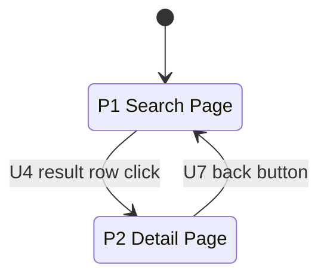
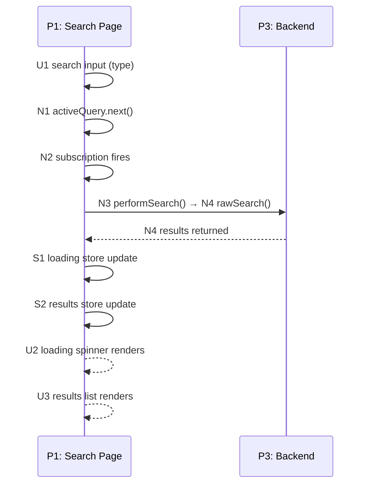

# Breadboarding (Plain English Guide)

Breadboarding maps out a system — either one that already exists or one you're designing — by capturing four things:

- **Places** — the distinct screens or boundaries the user moves between (a page, a modal, the backend)
- **UI (U#)** — what the user sees or interacts with: buttons, inputs, displays, spinners
- **Code (N#)** — functions and handlers you can call or observe
- **Stores (S#)** — state that persists and is read and written
- **Flows** — how those elements connect, shown as a state diagram (navigation) and a sequence diagram (temporal flow)

---

## What Is It Used For?

### 1. Understanding an Existing System

Use this when you're trying to figure out how something already works — for example, why a bug is happening, or how data moves through the system.

**You bring:**
- The code (one or more repos)
- A description of the workflow to trace, written from the perspective of someone trying to make something happen (e.g. "I click Submit — what happens next?")

**You get back:**
- A Places list
- UI, Code, and Stores tables
- A state diagram showing navigation between Places
- A sequence diagram showing the flow

If the workflow spans a frontend and a backend, make one breadboard that covers both. Label Places clearly so it's obvious which system each one belongs to.

### 2. Designing Something New

Use this when you've sketched out a new feature as a list of parts and need to work out the exact details — what UI, Code, and Stores are needed and how they flow together.

**You bring:**
- A list of parts (from your design/shaping work)
- The goal or outcome those parts are meant to achieve
- The existing system (if the new parts need to plug into it)

**You get back:**
- Same four artefacts as above

### 3. When You Have Both

Often you'll have an existing system plus some new changes. Breadboard both together — show the existing UI, Code, and Stores alongside the new ones, and trace the combined flow in one sequence diagram.

### 4. Reading a Hand-Drawn Breadboard

Sometimes breadboards are sketched on a whiteboard. The same concepts apply — Places, UI/Code/Stores, Flows — but the layout uses visual stacking instead of tables.

| Visual Element | What It Means |
|---|---|
| Coloured block at the top of a stack | A Place |
| Blocks stacked underneath | UI or Code elements belonging to that Place |
| Code blocks floating between stacks | Code elements (functions, etc.) |
| Block at the top-left of a Place | A loader — what data the Place needs to render |
| Solid arrows | Triggers → (what calls what) |
| Dashed arrows | Feeds ← (where results flow back) |
| Indented blocks in a different colour | Conditional branches (if/else logic) |
| `_PlaceName` in a stack | A reference to another Place defined elsewhere |
| `?` or `~` prefix, or dashed border | Speculative — not confirmed yet |
| Large box around multiple stacks | A system or responsibility boundary |
| Freeform text | Notes, open questions, or context |

**Converting to the standard format:** Map each stack to its Place, list UI/Code/Stores in their respective tables, and turn arrows into sequence diagram messages labelled with their IDs.

---

## Core Concepts

### Places

A **Place** is "where you are" in the interface — a bounded situation with a specific set of UI elements available. When you're in a Place, you can only interact with what's there. To do something else, you have to leave.

A Place is about the user's experience, not technical details like URLs or components.

#### The Blocking Test

The easiest way to tell if something is a new Place: **can you still interact with what's behind it?**

| Answer | Meaning |
|---|---|
| No — you're blocked | You're in a different Place |
| Yes — you can still click around | Same Place, just a local change |

#### Examples

| UI Element | Blocking? | New Place? | Why |
|---|---|---|---|
| Modal dialog | Yes | Yes | You can't click anything behind it |
| Confirmation popover | Yes | Yes | You must respond before moving on |
| Edit mode (whole screen changes) | Yes | Yes | Everything on screen is different |
| Checkbox that reveals extra fields | No | No | The rest of the screen is unchanged |
| Dropdown menu | No | No | You can click away |
| Tooltip | No | No | Just informational, doesn't block anything |

#### Local Change vs. Navigation

Ask yourself: did *everything* change, or just a small part while the rest stayed the same?

| Type | What Happens | How to Handle It |
|---|---|---|
| Local change | Only part of the UI changes | Same Place — model it as a conditional |
| Navigation | Whole screen changes, or something blocking appears | Different Place |

#### Mode-Based Places

If a "mode" (like Edit Mode) transforms the entire screen, treat it as a separate Place:

```
P1: CMS Page (Read Mode)
P2: CMS Page (Edit Mode)
```

The flag that switches between modes is just a navigation mechanism — don't list it as a Store inside either Place.

#### Three Questions for Any Button or Control

1. Where did I come from to see this?
2. Where am I right now?
3. Where do I end up if I use it?

If the answer to #3 is "everything changes" or "I can't interact with what's behind until I respond," you're navigating to a new Place.

#### Naming Places

| Pattern | When to Use |
|---|---|
| `P#: Page Name` | A standard page or route |
| `P#: Page Name (Mode)` | A mode-based version of a page |
| `P#: Modal Name` | A modal dialog |
| `P#: Backend` | The API or database layer |

When spanning multiple systems: `P1: Checkout Page (frontend)`, `P4: Payment API (backend)`.

#### Sub-Places

A **sub-place** is a defined section within a Place — useful when a Place has multiple distinct widgets or areas. Use hierarchical IDs: `P2.1`, `P2.2`, etc.

When zooming in on one sub-place, add a placeholder to show there's more on the page:
```
[... other page content ...]
```

### UI (U#)

**UI elements** are what the user sees or interacts with. Every UI element gets a `U#` ID.

Examples: buttons, inputs, text displays, spinners, scroll areas, result rows, notification banners.

### Code (N#)

**Code elements** are functions and handlers you can call or observe. Every code element gets an `N#` ID.

Examples: event handlers, API calls, subscriptions, framework hooks, async tasks.

### Stores (S#)

**Stores** are state that persists and is read and written. Every store gets an `S#` ID.

Examples: observables, arrays, booleans, browser URL, localStorage, clipboard.

Stores have a different lifecycle from Code: they aren't called, they're written to and read from. A store belongs in the Place where its data is *consumed* — not where it's produced.

### Flows

A Flow describes how elements connect. There are two directions:

- **Triggers →** — what a UI or Code element calls next (a function call, a write to a store, navigation to a new Place)
- **Feeds ←** — where data flows back to (a store providing data to a display, a query result returning to its caller)

Flows are shown in a state diagram (for navigation between Places) and a sequence diagram (for temporal flow within a workflow).

---

## The Four Artefacts

Every breadboard produces exactly these four things, preceded by a **Legend**.

### Legend

Include this at the top of every breadboard document so it is self-contained:

| Prefix | Type | Definition |
|---|---|---|
| P# | Place | A bounded context of interaction — where you are and what you can do |
| U# | UI | What the user sees or interacts with |
| N# | Code | Functions and handlers you can call or observe |
| S# | Store | State that persists and is read and written |

### 1. Places List

A simple numbered table of every Place in the workflow.

| # | Place | Description |
|---|---|---|
| P1 | Search Page | Main search interface |
| P2 | Detail Page | Individual result view |
| P3 | Backend | Search service and data layer |

### 2. UI Table

Every element the user sees or interacts with, defined once.

| # | Name | Description | Triggers | Feeds |
|---|---|---|---|---|
| U1 | Search input | Text field where the user types a query | N1 | |
| U2 | Loading spinner | Renders while S1 is true | | |
| U3 | Results list | Renders each hit from S2 | | |
| U4 | Result row | Click navigates to P2 | P2 | |

### 3. Code Table

Every function, subscription, and handler, defined once.

| # | Name | Description | Triggers | Feeds |
|---|---|---|---|---|
| N1 | `activeQuery.next()` | Pushes query into the observable stream | N2 | |
| N2 | `activeQuery` subscription | Observes stream with 90ms debounce; fires when ≥ 3 chars | N3 | |
| N3 | `performSearch()` | Sets loading state, calls search service | N4, S1, S2 | |
| N4 | `rawSearch()` | Queries the search index | | S2 |

### 4. Stores Table

Every piece of state that persists and is read and written, defined once.

| # | Name | Description | Written by | Feeds |
|---|---|---|---|---|
| S1 | `loading` | Boolean loading state | N3 | U2 |
| S2 | `results` | Array of search result hits | N3, N4 | U3 |

### 5. State Diagram

A Mermaid `stateDiagram-v2` showing Places as states and navigation as labelled transitions. Include whenever the breadboard has user-facing Places with navigation between them; optional for purely backend/system flows.



### 6. Sequence Diagram

A Mermaid sequence diagram with one lifeline per Place. Arrows are labelled with element IDs. Solid arrows show Triggers →. Dashed arrows show Feeds ←.



**Line conventions:**

| Arrow | Mermaid Syntax | Meaning |
|---|---|---|
| Solid `->>`  | `A ->> B: label` | Triggers → (calls, writes, navigates) |
| Dashed `-->>`| `A -->> B: label` | Feeds ← (return values, store reads) |

---

## Step-by-Step Procedures

### Mapping an Existing System

**Step 1: Identify Places.**
Walk through the user journey and list every distinct Place — every screen, modal, or system boundary the user crosses.

**Step 2: Trace through the code.**
Starting from the entry point (a route, an API endpoint), follow the code to find every component touched by that flow.

**Step 3: Fill the UI, Code, and Stores tables.**
For each component, identify every button, input, display, function, subscription, and store involved. Assign U#, N#, or S# IDs. Use real names — if you write "DATABASE," stop and find the actual method (`userRepo.save()`).

**Step 4: Fill in Triggers and Feeds for each row.**
For each element, note what it triggers next and what it feeds data to. Use the ID (e.g. `N3`, `S1`) not prose descriptions.

**Step 5: Draw a state diagram to show navigation.**
Place each user-facing Place as a state node. Draw transitions labelled with the U# that causes navigation.

**Step 6: Draw a sequence diagram to show flow.**
Place each Place as a lifeline. Draw solid arrows for Triggers → and dashed arrows for Feeds ←, labelled with element IDs. Trace the full journey from the first user interaction to the final visible result.

**Step 7: Check against the code.**
Read the code again. Confirm every element exists and both diagrams match reality.

---

### Designing Something New

**Step 1: Identify Places.**
For each part in your design, decide which Place it lives in — an existing one being modified, or a new one being created.

**Step 2: Fill the UI, Code, and Stores tables.**
For each part, identify the UI elements the user will see, the Code elements that implement it, and the Stores that hold state. Assign IDs.

**Step 3: Make sure every UI element that shows data has a Store or Code element feeding it.**
For each U# that displays data, check: which N# or S# provides that data? If none exists, add it.

**Step 4: Draw a state diagram.**
Check that every Place is reachable from the entry point. Every terminal Place (no outgoing transitions) should be intentional.

**Step 5: Draw a sequence diagram to show flow.**
Trace the intended behaviour from start to finish. Use solid arrows for Triggers → and dashed arrows for Feeds ←.

**Step 6: Connect to the existing system (if needed).**
Add the existing elements the new ones must connect to in the tables. Show those connections in the sequence diagram.

**Step 7: Check for completeness.**
- Every U# that shows data should have an N# or S# feeding it
- Every N# should appear in at least one arrow in the sequence diagram
- Every S# should have something feeding from it (a U# reading it)
- Every Place should be reachable in the state diagram

**Step 8: Treat everything the user sees as a U#.**
Emails, notifications, and any other visible output are UI elements and need a Code or Store element feeding them.

---

## Key Rules

### Always check the tables — don't rely on memory

When tracing a flow backwards, scan the Triggers and Feeds columns for all elements that reference your target. Don't follow what you think you remember.

### Every name must be real (when mapping existing code)

Never invent abstractions. Every N# name must point to something real in the codebase.

### Not everything qualifies

Each type has a threshold:

| Type | Example | Why It Doesn't Qualify |
|---|---|---|
| Visual containers | `modal-frame wrapper` | You can't interact with a wrapper — it's just a Place boundary |
| Internal transforms | `letterDataTransform()` | An implementation detail of its caller; give the output to the caller's Feeds |
| Navigation mechanisms | `modalService.open()` | Just the "how" of getting to a Place — draw the arrow directly to the Place |

```
❌ N8 → N22 → P3     (N22 is modalService.open — just a mechanism)
✅ N8 → P3           (code navigates to place)

❌ N6 → N20 → S2     (N20 is a data transform — internal to N6)
✅ N6 → S2           (code writes to store)
```

### Every U# that shows data needs a source

```
❌ U3: results list — no incoming Feeds arrow
✅ S2 (results store) feeds U3
✅ N4 (query result) feeds U3
```

If a display has no data source, either the source is missing or the display isn't real.

### Every N# must appear in the sequence diagram

- Functions → should have at least one outgoing Triggers → arrow
- Queries → should have at least one incoming Feeds ← arrow

### Side effects need their own S# entry

If a Code element has side effects outside the system boundary (browser URL, localStorage, external API, analytics), add a Store for that external state and draw an arrow to it:

```
❌ N41: updateUrl() — no outgoing arrow
✅ N41: updateUrl() → S5 (Browser URL store)
```

Common external state to model as Stores:
- Browser URL (query params, hash fragments)
- `localStorage` / `sessionStorage`
- Clipboard
- Browser History

### Keep Triggers and Feeds distinct

Solid arrows show what calls what. Dashed arrows show where data goes. Don't mix them up in the sequence diagram.

### Show navigation inline

Draw navigation arrows directly from the element that causes navigation to the destination Place lifeline. Don't route everything through a central Router entry.

### The backend is a Place too

The database and API resolvers aren't floating infrastructure — they're a Place with their own Code and Stores. Give them a lifeline in the sequence diagram.

---

## Additional References

- **Element types and verification checklist**: See [REFERENCE.md](REFERENCE.md)
- **Chunking and slicing guidance**: See [SLICING.md](SLICING.md)
- **Worked breadboarding examples**: See [EXAMPLES.md](EXAMPLES.md)
