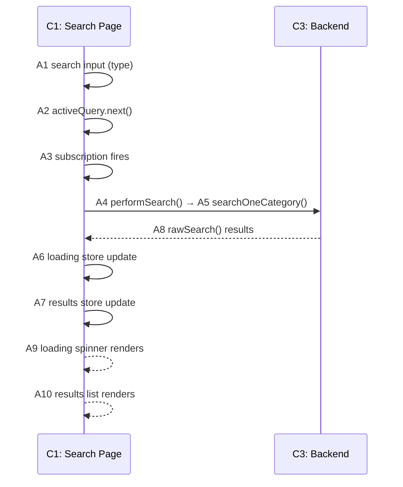

# Breadboarding (Plain English Guide)

Breadboarding maps out a system — either one that already exists or one you're designing — by capturing three things:

- **Contexts** — the distinct screens or boundaries the user moves between (a page, a modal, the backend)
- **Actions** — every button, input, display, function, and data store involved, each given a single ID
- **Flows** — how those Actions connect and trigger each other, shown as a sequence diagram

---

## What Is It Used For?

### 1. Understanding an Existing System

Use this when you're trying to figure out how something already works — for example, why a bug is happening, or how data moves through the system.

**You bring:**
- The code (one or more repos)
- A description of the workflow to trace, written from the perspective of someone trying to make something happen (e.g. "I click Submit — what happens next?")

**You get back:**
- A Context list
- An Actions Reference
- A sequence diagram showing the Flow

If the workflow spans a frontend and a backend, make one breadboard that covers both. Label Contexts clearly so it's obvious which system each one belongs to.

### 2. Designing Something New

Use this when you've sketched out a new feature as a list of parts and need to work out the exact details — what Actions are needed and how they Flow together.

**You bring:**
- A list of parts (from your design/shaping work)
- The goal or outcome those parts are meant to achieve
- The existing system (if the new parts need to plug into it)

**You get back:**
- Same three artefacts as above

### 3. When You Have Both

Often you'll have an existing system plus some new changes. Breadboard both together — show the existing Actions and the new ones in one Actions Reference, and trace the combined Flow in one sequence diagram.

### 4. Reading a Hand-Drawn Breadboard

Sometimes breadboards are sketched on a whiteboard. The same concepts apply — Contexts, Actions, Flows — but the layout uses visual stacking instead of tables.

| Visual Element | What It Means |
|---|---|
| Coloured block at the top of a stack | A Context |
| Blocks stacked underneath | Actions belonging to that Context |
| Code blocks floating between stacks | System Actions (functions, etc.) |
| Block at the top-left of a Context | A loader — what data the Context needs to render |
| Solid arrows | Control Flow → (what triggers what) |
| Dashed arrows | Data Output ← (where results flow back) |
| Indented blocks in a different colour | Conditional branches (if/else logic) |
| `_ContextName` in a stack | A reference to another Context defined elsewhere |
| `?` or `~` prefix, or dashed border | Speculative — not confirmed yet |
| Large box around multiple stacks | A system or responsibility boundary |
| Freeform text | Notes, open questions, or context |

**Converting to the standard format:** Map each stack to its Context, list Actions top to bottom in the Actions Reference, and turn arrows into sequence diagram messages labelled with Action IDs.

---

## Core Concepts

### Contexts

A **Context** is "where you are" in the interface — a bounded situation with a specific set of Actions available. When you're in a Context, you can only interact with what's there. To do something else, you have to leave.

A Context is about the user's experience, not technical details like URLs or components.

#### The Blocking Test

The easiest way to tell if something is a new Context: **can you still interact with what's behind it?**

| Answer | Meaning |
|---|---|
| No — you're blocked | You're in a different Context |
| Yes — you can still click around | Same Context, just a local change |

#### Examples

| UI Element | Blocking? | New Context? | Why |
|---|---|---|---|
| Modal dialog | Yes | Yes | You can't click anything behind it |
| Confirmation popover | Yes | Yes | You must respond before moving on |
| Edit mode (whole screen changes) | Yes | Yes | Everything on screen is different |
| Checkbox that reveals extra fields | No | No | The rest of the screen is unchanged |
| Dropdown menu | No | No | You can click away |
| Tooltip | No | No | Just informational, doesn't block anything |

#### Local Change vs. Navigation

Ask yourself: did *everything* change, or just a small part while the rest stayed the same?

| Type | What Happens | How to Handle It |
|---|---|---|
| Local change | Only part of the UI changes | Same Context — model it as a conditional |
| Navigation | Whole screen changes, or something blocking appears | Different Context |

#### Mode-Based Contexts

If a "mode" (like Edit Mode) transforms the entire screen, treat it as a separate Context:

```
C1: CMS Page (Read Mode)
C2: CMS Page (Edit Mode)
```

The flag that switches between modes is just a navigation mechanism — don't list it as data inside either Context.

#### Three Questions for Any Button or Control

1. Where did I come from to see this?
2. Where am I right now?
3. Where do I end up if I use it?

If the answer to #3 is "everything changes" or "I can't interact with what's behind until I respond," you're navigating to a new Context.

#### Naming Contexts

| Pattern | When to Use |
|---|---|
| `C#: Page Name` | A standard page or route |
| `C#: Page Name (Mode)` | A mode-based version of a page |
| `C#: Modal Name` | A modal dialog |
| `C#: Backend` | The API or database layer |

When spanning multiple systems: `C1: Checkout Page (frontend)`, `C4: Payment API (backend)`.

#### Sub-Contexts

A **sub-context** is a defined section within a Context — useful when a Context has multiple distinct widgets or areas. Use hierarchical IDs: `C2.1`, `C2.2`, etc.

When zooming in on one sub-context, add a placeholder to show there's more on the page:
```
[... other page content ...]
```

### Actions

**Actions** are the individual pieces you can act on. Every Action gets a single ID in the format `A1`, `A2`, `A3`, …

There are two kinds:

- **Action (UI):** Anything the user sees or interacts with — buttons, inputs, text displays, spinners, scroll areas
- **Action (System):** Anything in the code that can be triggered or observed — functions, subscriptions, data stores, framework hooks

Both kinds live in the same Actions Reference. The type is noted in the definition.

### Flows

A Flow describes how Actions connect. There are two directions:

- **Control Flow →** — what an Action triggers or calls (a function call, a write to a data store, navigation to a new Context)
- **Data Output ←** — where an Action's result goes (a return value flowing back to its caller, a data store being read)

Flows are shown in a sequence diagram, not in table columns. Solid arrows represent Control Flow →. Dashed arrows represent Data Output ←.

---

## The Three Artefacts

Every breadboard produces exactly these three things.

### 1. Context List

A simple numbered list of every Context in the workflow.

| # | Context | Description |
|---|---|---|
| C1 | Search Page | Main search interface |
| C2 | Detail Page | Individual result view |
| C3 | Backend | Search service and data layer |

### 2. Actions Reference

A single bullet list where every Action — UI or System — is defined once. Each entry follows this format:

> **A#** – name: short description of what it does.

The type (UI or System) is noted in parentheses where it helps clarity.

**Example:**

- **A1** – search input (UI): text field where the user types a query; triggers A2 on each keystroke
- **A2** – `activeQuery.next()` (System): pushes the new query value into the observable stream; triggers A3
- **A3** – `activeQuery` subscription (System): observes the stream with a 90ms debounce; triggers A4 when value is ≥ 3 chars
- **A4** – `performSearch()` (System): sets loading state, calls the search service; triggers A5, A6, A7
- **A5** – `searchOneCategory()` (System): builds the Typesense filter and calls A8; returns results to A4
- **A6** – `loading` store (System): holds the boolean loading state; feeds A9
- **A7** – `results` store (System): holds the array of search results; feeds A10
- **A8** – `rawSearch()` (System): queries Typesense; returns `{found, hits}` to A5
- **A9** – loading spinner (UI): renders while A6 is true
- **A10** – results list (UI): renders each hit from A7
- **A11** – result row (UI): click navigates to C2

### 3. Sequence Diagram

A Mermaid sequence diagram with one lifeline per Context. Arrows between lifelines are labelled with Action IDs. Solid arrows show Control Flow →. Dashed arrows show Data Output ←.



**Line conventions:**

| Arrow | Mermaid Syntax | Meaning |
|---|---|---|
| Solid `->>`  | `A ->> B: label` | Control Flow → (triggers, calls, writes) |
| Dashed `-->>`| `A -->> B: label` | Data Output ← (return values, store reads) |

---

## Step-by-Step Procedures

### Mapping an Existing System

**Step 1: Identify Contexts.**
Walk through the user journey and list every distinct Context — every screen, modal, or system boundary the user crosses.

**Step 2: Trace through the code.**
Starting from the entry point (a route, an API endpoint), follow the code to find every component touched by that flow.

**Step 3: List Actions once in the Actions Reference.**
For each component, identify every button, input, display, function, subscription, and data store involved. Give each one an A-ID and write a short definition. Use real names — if you write "DATABASE," stop and find the actual method (`userRepo.save()`).

**Step 4: Note Control Flow → and Data Output ← in each definition.**
In the definition for each Action, describe what it triggers (Control Flow →) and where its output goes (Data Output ←). This is prose in the Actions Reference, not columns in a table.

**Step 5: Draw a sequence diagram to show Flows.**
Place each Context as a lifeline. Draw solid arrows for Control Flow → and dashed arrows for Data Output ←, labelled with Action IDs. Trace the full journey from the first user interaction to the final visible result.

**Step 6: Check against the code.**
Read the code again. Confirm every Action exists and the sequence diagram matches reality.

---

### Designing Something New

**Step 1: Identify Contexts.**
For each part in your design, decide which Context it lives in — an existing one being modified, or a new one being created.

**Step 2: List Actions once in the Actions Reference.**
For each part, identify the UI Actions the user will see and the System Actions that implement it. Give each an A-ID and write a short definition.

**Step 3: Make sure every UI Action has a System Action supporting it.**
For each UI Action that displays data, check: which System Action provides that data? If none exists, add it.

**Step 4: Draw a sequence diagram to show Flows.**
Trace the intended behaviour from start to finish. Use solid arrows for Control Flow → and dashed arrows for Data Output ←.

**Step 5: Connect to the existing system (if needed).**
Add the existing Actions the new ones must connect to in the Actions Reference. Show those connections in the sequence diagram.

**Step 6: Check for completeness.**
- Every UI Action that shows data should have a System Action feeding it
- Every System Action should appear in at least one arrow in the sequence diagram
- Functions should have outgoing Control Flow → arrows
- Queries should have incoming Data Output ← arrows
- Data stores should have at least one read arrow pointing out of them

**Step 7: Treat everything the user sees as a UI Action.**
Emails, notifications, and any other visible output are UI Actions and need a System Action flowing to them.

---

## Key Rules

### Always check the Actions Reference — don't rely on memory

When tracing a flow backwards, scan the definitions for all Actions that mention your target in their Control Flow →. Don't follow what you think you remember.

### Every name must be real (when mapping existing code)

Never invent abstractions. Every Action name must point to something real in the codebase.

### Not everything is an Action

An Action is something you can act on that has meaningful identity in the system. Some things look like Actions but are actually just implementation details:

| Type | Example | Why It's Not an Action |
|---|---|---|
| Visual containers | `modal-frame wrapper` | You can't act on a wrapper — it's just a Context boundary |
| Internal transforms | `letterDataTransform()` | An implementation detail of the caller |
| Navigation mechanisms | `modalService.open()` | Just the "how" of getting to a Context — draw the arrow directly to the Context |

When reviewing your Actions Reference, ask for each System Action: "Is this actually something I can act on, or is it just describing *how* something happens?" If it's just the "how," remove it and draw the sequence arrow directly to the destination.

```
❌ A8 → A22 → C3     (A22 is modalService.open — just a mechanism)
✅ A8 → C3           (action navigates to context)

❌ A6 → A20 → S2     (A20 is a data transform — internal to A6)
✅ A6 → S2           (callback writes to store)
```

### Two flows to trace: Navigation and Data

| Flow | What It Tracks | Arrow Type |
|---|---|---|
| **Control Flow →** | How the user moves between Contexts; what triggers what | Solid `->>` |
| **Data Output ←** | How results and state flow back to what the user sees | Dashed `-->>` |

When reviewing a sequence diagram, trace both: can you follow the user's journey from Context to Context? And for every UI Action that shows data, can you trace where that data comes from?

### Every UI Action that shows data needs a source

```
❌ A10: results list — no incoming Data Output arrow
✅ A7 (results store) -->> A10 (store feeds the display)
✅ A5 -->> A10 (query result feeds the display)
```

If a display has no data source, either the source is missing or the display isn't real.

### Every System Action must appear in the sequence diagram

- Functions → should have at least one outgoing Control Flow → arrow
- Queries → should have at least one incoming Data Output ← arrow
- Data stores → should have at least one read arrow pointing out

### Side effects need their own Action entry

If a System Action has side effects outside the system boundary (browser URL, localStorage, external API, analytics), add a separate Action entry for that external state and draw an arrow to it:

```
❌ A41: updateUrl() — no outgoing arrow
✅ A41: updateUrl() → A42 (Browser URL store)
```

Common external state to model as Actions:
- Browser URL (query params, hash fragments)
- `localStorage` / `sessionStorage`
- Clipboard
- Browser History

### Keep Control Flow and Data Output distinct

Solid arrows show what triggers what. Dashed arrows show where output goes. Don't mix them up in the sequence diagram.

### Show navigation inline

Draw navigation arrows directly from the Action that causes navigation to the destination Context lifeline. Don't route everything through a central Router entry.

### Put data stores in the Context where their data is consumed

A data store belongs in the Context where its data is *used* to make something happen — not where it's written. Trace who reads it; that determines which Context it belongs to.

### The backend is a Context too

The database and API resolvers aren't floating infrastructure — they're a Context with their own Actions. List them in the Actions Reference and give them a lifeline in the sequence diagram.

---

## Additional References

- **Element types and verification checklist**: See [REFERENCE.md](REFERENCE.md)
- **Chunking and slicing guidance**: See [SLICING.md](SLICING.md)
- **Worked breadboarding examples**: See [EXAMPLES.md](EXAMPLES.md)
