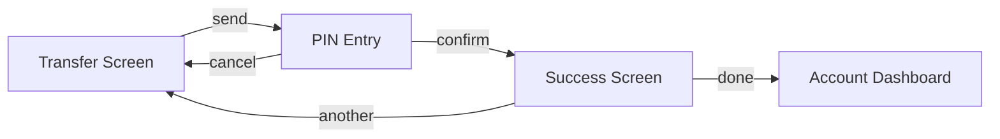
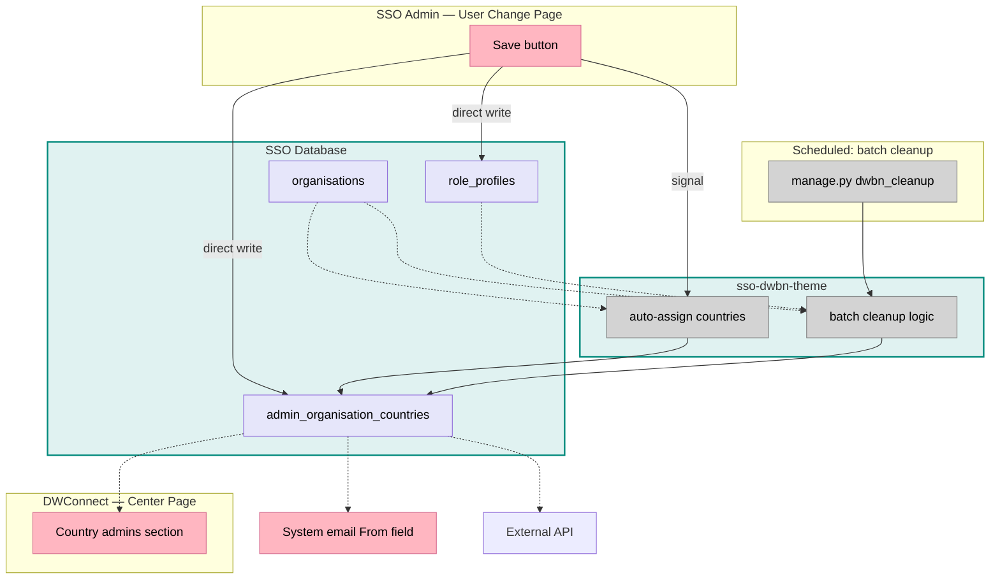
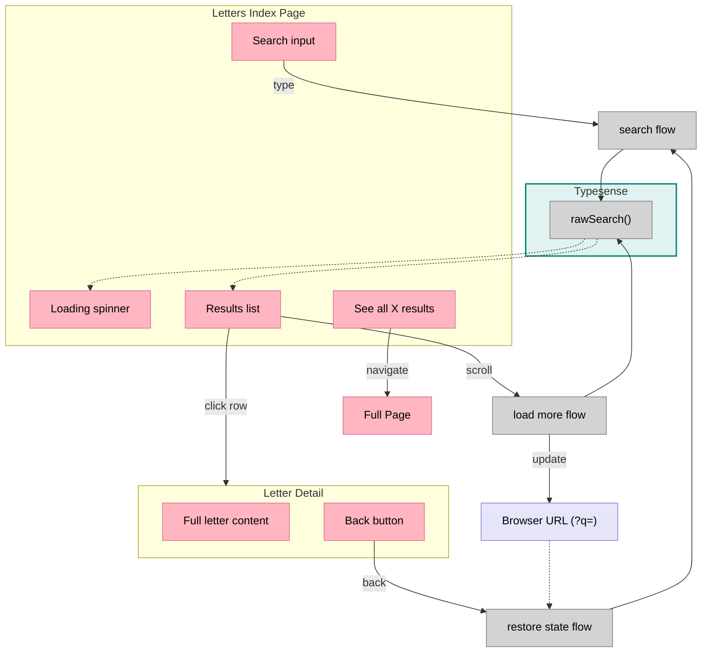

# Breadboarding

Breadboarding maps out how a system works — what users see on each screen, what they can do, and what happens underneath. The output is a set of **See-Do tables** (one per screen) with optional **behavior flows** that explain the logic behind complex actions.

---

## What It Produces

### Two Layers

**Layer 1: See-Do tables (always)**

For every screen, two columns:

- **See** — Everything the user can see: labels, data, status, content
- **Do** — Everything the user can act on: buttons, inputs, links, gestures

Do items point to where they go: another screen, or a named behavior flow.

**Layer 2: Behavior flows (when needed)**

When a Do action involves complex logic — API calls, data transforms, conditional paths — describe the steps in a behavior flow. This is the "how it works" layer.

You always produce Layer 1. You produce Layer 2 when the logic behind an action matters — for implementation planning, code mapping, or explaining non-obvious behavior.

---

## When to Use

### 1. Mapping an Existing System

You want to understand how something currently works. You have a workflow — "user does X, then Y happens" — and you want to trace the real path through screens and code.

**What you need:**

- Code repo(s)
- A workflow to trace (always from the user's point of view)

**What you produce:**

- See-Do tables for each screen in the flow
- Behavior flows for the code paths involved
- (Optional) Flow map diagram

**Note:** If the workflow spans multiple applications (frontend + backend), create one breadboard that tells the full story. Use screens for UI and systems for backend boundaries.

### 2. Designing from Shaped Parts

You have a new system sketched as parts (from shaping). You need to detail what each screen looks like and how the parts connect.

**What you need:**

- Parts list (from shaping)
- The requirement the parts are meant to achieve
- Existing system (optional) — if the new parts connect to existing code

**What you produce:**

- See-Do tables for each screen
- Behavior flows for complex parts
- (Optional) Flow map diagram

### 3. Mixtures

Often you have both: an existing system plus new parts or changes. Map them together — existing screens and new ones — showing how they connect.

### 4. Reading a Whiteboard Breadboard

Hand-drawn or whiteboard breadboards use a visual stacking format. The same ideas apply but the layout is different.

| Element | How it appears |
|---------|---------------|
| **Screen** | Colored block at the top of a vertical stack |
| **Elements in a screen** | Blocks stacked underneath the screen block |
| **Behaviors** | Float between screen stacks |
| **Screen loader** | Behavior at the top-left — what data the screen needs to show |
| **Solid arrows** | "This triggers that" |
| **Dashed arrows** | "This data feeds that" |
| **Conditionals** | Indented blocks, often a different color |
| **`?` or `~` prefix** | Tentative — might not survive shaping |
| **Containing box** | Groups stacks by system or responsibility |

**To convert a whiteboard to See-Do format:**

1. Find the screen blocks (colored headers at top of each stack)
2. Read each stack top-to-bottom — visible items go in See, interactive items go in Do
3. Trace the arrows between stacks — these become behavior flows
4. Note loaders — they become behavior flows that feed See items

---

## Core Concepts

### Screens

A screen is wherever the user currently is — what they can see and do right now. While on a screen, you have a specific set of things available. You can't interact with things outside that boundary without leaving first.

**The Blocking Test:** Can you interact with what's behind?

| Answer | What it means |
|--------|---------------|
| **No** | You're on a different screen |
| **Yes** | Same screen, just some things changed |

| UI Element | Different screen? | Why |
|------------|:-----------------:|-----|
| Modal | Yes | Can't interact with the page behind |
| Edit mode (everything changes) | Yes | All the elements are different |
| Confirmation dialog | Yes | Must respond before continuing |
| Checkbox reveals extra fields | No | Surroundings unchanged |
| Dropdown menu | No | Can click away |
| Tooltip | No | Just informational |

When a mode like "edit mode" changes the entire screen, treat each mode as a separate screen:

```
Transfer Screen
Transfer Screen (Edit Mode)
```

**Three questions for any interactive element:**

1. Where did I come from to see this?
2. Where am I now?
3. Where do I go if I act on it?

If the answer to #3 is "everything changes" or "I can't interact with what's behind until I respond," that's a different screen.

Give each screen a clear, descriptive name. That name becomes its heading in the See-Do document.

### Widgets and Sub-Sections

When a screen contains distinct widgets or sections, you can either:

**Inline them** — group related See/Do items with a bold label:

| See | Do |
|-----|-----|
| **Sales Widget** | |
| Revenue total | Tap "Details" → **Sales Detail** |
| **Activity Feed** | |
| Recent activity list | Tap activity → **Activity Detail** |

**Break them out** — give each its own See-Do table:

#### Dashboard — Sales Widget

| See | Do |
|-----|-----|
| Revenue total | Tap "Details" → **Sales Detail** |

#### Dashboard — Activity Feed

| See | Do |
|-----|-----|
| Recent activity list | Tap activity → **Activity Detail** |

For reusable widgets that appear on multiple screens, define the widget once and reference it: "This screen includes the **Letter Browser** widget (see Letter Browser below)."

### Systems

A system is a backend boundary — an API, database, worker, or service. Users never "visit" a system. Systems have logic and data but no See column.

Examples: Payment API, Search Backend, Notification Worker.

If something has user-visible elements, it's a screen. If it only has logic and data, it's a system. If you find yourself writing a See-Do table for an API, stop — that's a system.

### The See-Do Format

Each screen gets a table with two columns.

**See** — What the user can see. Static content: labels, data, images, status indicators, headings, lists.

**Do** — What the user can act on. Interactive elements: buttons, links, inputs, toggles, gestures. Each Do item says where it goes:

| Where the action goes | How to write it |
|----------------------|-----------------|
| Another screen | Tap "Send" → **PIN Entry** |
| A behavior flow | Type query → `search` |
| Same screen (local change) | Toggle filter → updates list |

### Behavior Flows

A behavior flow explains the steps behind a complex Do action. When someone types in a search box and results appear — what actually happens in between?

**Step list** — for simple, linear flows:

**`search`** — triggered by typing in search input

1. Push query to search subject
2. Wait 90ms (debounce), require at least 3 characters
3. Call search API with query and filters
4. Store results, set loading state
5. Re-render the results list

**Step table** — for flows that cross system boundaries or have complex wiring:

| Step | What happens | Calls |
|------|-------------|-------|
| handleSubmit() | Validates form, builds payload | → createOrder API |
| createOrder API | Creates order, charges payment | → paymentService |
| paymentService | Processes card | returns to → createOrder |
| createOrder API | Saves order, sends confirmation | returns to → handleSubmit |

When mapping existing code, use real names — actual function names, service names, API endpoints. Don't write "DATABASE" when you mean `userRepo.save()`.

### Data Stores

A data store is state that gets written and read — a results array, a loading flag, the browser URL. When a behavior flow writes to a store and something else reads from it, note the store.

List data stores when they bridge between behavior flows and See items, or when multiple parts of the system share state:

| Store | What it holds | Used by |
|-------|--------------|---------|
| searchResults | Array of matching items | Letters Index Page (results list) |
| loading | Whether a search is in progress | Letters Index Page (spinner) |
| Browser URL (?q=) | Current search query | restore state flow |

Common stores to watch for:

- App state (results, loading, selections, form data)
- Browser URL (query params, hash fragments)
- Local/session storage
- Clipboard

### How the Layers Connect

```
See-Do table
  └── Do item: "Type query → `search`"
                                 ↓
Behavior flow: `search` (steps 1-5)
                                 ↓
Result: updates See items (results list, loading spinner)
```

The See column shows what's visible. The Do column shows what's interactive. Behavior flows explain what happens when the user acts. The cycle completes when a behavior flow produces changes that show up in the See column.

---

## The Output

### Always: See-Do Tables

One per screen. List everything the user can see and do.

#### Example: Transfer Flow

**Transfer Screen**

| See | Do |
|-----|-----|
| Available balance | Enter amount → **Amount Confirmation** |
| Recipient name and account number | Change recipient → **Recipient Search** |
| Bank name | Add note (optional) |
| Transfer fee (if any) | Tap "Send" → **PIN Entry** |
| Recent recipients list | Select recent recipient → fills in details |

**PIN Entry**

| See | Do |
|-----|-----|
| Transfer summary (amount, recipient) | Enter PIN digits |
| "Enter your PIN" prompt | Tap "Confirm" → `process transfer` → **Success Screen** |
| PIN input (masked) | Tap "Cancel" → **Transfer Screen** |

**Success Screen**

| See | Do |
|-----|-----|
| Success icon | Share receipt → **Share Sheet** |
| Amount sent | Tap "Done" → **Account Dashboard** |
| Recipient details | Make another transfer → **Transfer Screen** |
| Transaction reference number | |

The → arrows in the Do column link each action to the next screen or behavior. This naturally maps out the full flow.

### When Needed: Behavior Flows

For Do items that reference a named flow (backtick names), describe the steps:

**`process transfer`** — triggered by PIN confirmation

1. Send transfer request to banking API with amount, recipient, and PIN
2. API validates PIN, checks balance, processes transfer
3. On success: return transaction reference → navigate to **Success Screen**
4. On failure: show error message on **PIN Entry**

### When Needed: Systems

If the flow crosses backend boundaries, list them:

| System | What it does |
|--------|-------------|
| Banking API | Processes transfers, validates PINs |
| Notification Service | Sends transfer confirmation emails |

### When Needed: Data Stores

If behavior flows write and read shared state, list the stores:

| Store | What it holds | Used by |
|-------|--------------|---------| 
| transferState | Amount, recipient, note | Passed between screens |
| recentRecipients | Last 5 recipients | Transfer Screen (recent list) |

### Optional: Flow Map (Mermaid)

A simple diagram showing how screens connect:



For complex systems, you can add behavior-level detail to the diagram. But the See-Do tables are the primary artifact — the diagram is a visual aid.

#### Mermaid Conventions

| Line Style | Meaning | Syntax |
|------------|---------|--------|
| Solid arrow | Action or trigger | `A -->|action| B` |
| Dashed arrow | Data flow | `A -.->|data| B` |

| Element | Color |
|---------|-------|
| Screens | Pink `#ffb6c1` |
| Systems | Light teal `#e0f2f1` |
| Behaviors | Grey `#d3d3d3` |
| Data stores | Lavender `#e6e6fa` |

```
classDef ui fill:#ffb6c1,stroke:#d87093,color:#000
classDef nonui fill:#d3d3d3,stroke:#808080,color:#000
classDef store fill:#e6e6fa,stroke:#9370db,color:#000
```

---

## How to Create a Breadboard

### For Mapping an Existing System

**Step 1: Pick a user journey**

Frame it as someone trying to do something:

- "Land on /search, type a query, scroll for more, click a result"
- "Submit a transfer, enter PIN, see confirmation"

**Step 2: Walk through screen by screen**

For each screen the user visits:

- What can they see? → See column
- What can they do? → Do column
- Where does each action go? → Link to next screen or behavior flow

**Step 3: Name the actual thing**

When mapping real code, use real names. Don't write "DATABASE" — write the actual method (`userRepo.save()`). Don't write "API CALL" — write the endpoint (`POST /transfers`).

**Step 4: Trace complex actions into behavior flows**

For any Do action that involves code logic:

- Read the code
- List the steps in order
- Note what each step calls, reads, or writes
- Use real function and service names

**Step 5: Note data sources for See items**

For each See item that displays data, ask: where does this come from? If it's not obvious, annotate it in the See column or trace it in a behavior flow.

**Step 6: Check against the code**

Read the code again. Confirm:

- Every element you listed actually exists
- The connections match what the code actually does
- Nothing important was missed

### For Designing from Shaped Parts

**Step 1: List each part from the shape**

Write down every part/approach from the selected option.

**Step 2: Create See-Do tables per screen**

For each part, ask:

- What screen does this part appear on?
- What does the user see? → See column
- What can the user do? → Do column

**Step 3: Wire the flow**

Connect Do actions to destination screens or behavior flows. Trace the complete user journey.

**Step 4: Detail behavior flows for complex parts**

For parts that involve backend logic, data processing, or multi-step operations, write out the behavior steps.

**Step 5: Connect to existing system (if any)**

If there's an existing codebase:

- Identify where new parts plug into existing screens or systems
- Add existing elements to your See-Do tables
- Wire behavior flows to existing code

**Step 6: Check for completeness**

- Every See item that shows data — can you trace where it comes from?
- Every Do action — does it go somewhere (screen or behavior)?
- Every behavior flow — does it produce something visible?

---

## Key Principles

### Write in Plain Language

Use simple, clear words. Avoid jargon. Write so that someone without specialized knowledge can follow along.

- Say "the user goes to" not "the user navigates to a perceptual context"
- Say "this step calls the search API" not "N3 triggers N4 via the Typesense service boundary"
- Say "the results list updates" not "the data store feeds back to the interaction via detectChanges"

Technical terms are fine when they're the real names of things in the code — function names, API endpoints, service names. But the structure and explanation around them should be plain.

### Every See Item That Shows Data Needs a Source

If a See item displays data (not just a static label), ask: where does this come from?

- "Available balance" — from the account API? A cached value?
- "Results list" — populated by the search behavior flow?

If the source isn't obvious, either:

1. Annotate it in the See column: `Available balance (from account API)`
2. Trace it in a behavior flow

### Every Do Item Needs a Destination

Every Do action should say where it goes:

- A screen: `Tap "Send" → **PIN Entry**`
- A behavior flow: `Type query → \`search\``
- A local change: `Toggle filter → updates list`

A Do item that says "Click button" without saying what happens is incomplete.

### Don't Model Implementation Details as Separate Steps

A behavior flow should describe meaningful steps, not every line of code. Skip things like:

- Internal data transforms (just part of the calling function)
- Navigation mechanics (`router.navigate()` is just how you get to the next screen — wire to the screen directly)
- Visual containers (a modal wrapper isn't a step — the modal IS a screen)

Focus on what matters: what gets called, what data moves, what changes.

### Backend Is a System, Not a Screen

Users never "visit" the backend. If something has user-visible elements, it's a screen. If it only has logic and data, it's a system. Describe systems in behavior flows, not in See-Do tables.

### Place Data Stores Where They're Read

A data store belongs with whoever reads it — that's where it enables behavior. If a store is written by one screen but read by another, it belongs with the reader.

### Side Effects Need Stores

If a behavior step affects something outside the app (browser URL, localStorage, clipboard, external API), add a store for that external state. Otherwise the step looks like a dead end.

Common external stores: Browser URL, localStorage, sessionStorage, Clipboard.

---

## Slicing a Breadboard

Slicing takes a breadboard and groups its parts into steps you can build and demo one at a time.

### What Is a Slice?

A slice is a group of screen content and behavior that does something you can show. It cuts through all layers — UI, logic, data — to deliver a working piece.

The opposite is a horizontal layer: "set up all the database tables" (nothing to demo). **Every slice must end in something visible.**

- "Self-serve signing path" (demo: checkout → sign → see signature) — good slice
- "Database schema" (no demo possible) — not a slice

### How to Slice

**Step 1: Find the smallest working demo**

Ask: what's the least I can build that shows the core idea working?

Usually this is:

- Real data showing up on screen
- One basic interaction working end to end
- No search, no pagination, no state persistence yet

This becomes Slice 1.

**Step 2: Add capabilities as slices**

Each additional slice should demonstrate one approach working:

- Slice 2: "Search filters results"
- Slice 3: "Scroll loads more items"
- Slice 4: "Refresh preserves search state"

Aim for **9 slices or fewer**. If you need more, the shape might be too big for one cycle.

**Step 3: Write a demo statement for each slice**

Each slice needs a concrete "watch me do this" statement:

- Slice 1: "Page shows real data from the API"
- Slice 2: "Type 'tokyo', results filter in real time"
- Slice 3: "Scroll to the bottom, more items load"

**Step 4: List what each slice adds**

For each slice, note which See items, Do actions, and behavior flows it introduces:

| Slice | What it demonstrates | What it adds | Demo |
|-------|---------------------|--------------|------|
| V1 | Real data on screen | Results list + data fetch flow | "Widget shows letters from API" |
| V2 | Search works | Search input + search flow | "Type to filter results" |
| V3 | Infinite scroll | Scroll detection + pagination flow | "Scroll down, more load" |
| V4 | URL state preserved | URL read/write + state restore flow | "Refresh preserves search" |

### Showing Slices in a Diagram

Use styling to show what's built, what's being added, and what's coming:

| Category | Style |
|----------|-------|
| This slice | Bright green — being built now |
| Already built | Solid grey — previous slices |
| Future | Transparent, dashed border — not yet built |

```
classDef thisSlice fill:#90EE90,stroke:#228B22,color:#000
classDef built fill:#d3d3d3,stroke:#808080,color:#000
classDef future fill:none,stroke:#ddd,color:#bbb,stroke-dasharray:3 3
```

---

## Verification

After creating or changing a breadboard, check these:

### For See-Do Tables

- **Every See item that shows data** — Can you trace where it comes from?
- **Every Do action** — Does it point somewhere (screen or behavior)?
- **Every screen** — Is the name clear? Does it pass the blocking test?
- **Screen boundaries** — Did you accidentally combine two screens, or split one into two?

### For Behavior Flows

- **Every step** — Does it call something, write something, or produce something?
- **Dead ends** — A step that doesn't connect to anything is suspicious. Either it has side effects you haven't captured, or it's not real.
- **Real names** — When mapping code, every name should point to something that actually exists in the codebase.
- **Step scope** — Each step should describe its own direct effect, not the whole downstream chain.

### For the Full Flow

- **Trace each user story** — Start from the beginning of a journey and follow it through See-Do tables and behavior flows. Does the path make sense? Does it produce the expected result?
- **Check the round trip** — For every behavior flow, does its result show up in a See column somewhere?

---

## Quick Reference

| Term | What it means |
|------|--------------|
| **Screen** | Where the user currently is (passes the blocking test) |
| **System** | Backend boundary — API, database, worker (no user-facing elements) |
| **See** | Everything visible on a screen (static content, data) |
| **Do** | Everything interactive (buttons, inputs, links) → points to destination |
| **Behavior flow** | Steps that explain complex logic behind a Do action |
| **Data store** | State that's written and read (results, loading flags, URL params) |
| **Slice** | A buildable, demo-able piece of the system |

---
---

# Examples

## Example A: Mapping an Existing System

### Input

Workflow to understand: "How is `admin_organisation_countries` modified and read downstream? There are three entry points: manual edit, checkbox toggle, and batch job."

### Output

**SSO Admin — User Change Page**

| See | Do |
|-----|-----|
| Role profile checkboxes | Toggle "Country Admin" checkbox |
| Admin countries selector (superuser only): available countries, selected countries | Add/remove countries using arrow buttons |
| | Click "Save" → `save user` |

**DWConnect — Center Page**

| See | Do |
|-----|-----|
| "Country admins" section (list of admins for this center, from admin_organisation_countries) | |

**System Email**

| See | Do |
|-----|-----|
| "From" field (uses admin_organisation_countries) | |

---

**`save user`** — triggered by Save button on SSO Admin

| Step | What happens | Writes to |
|------|-------------|-----------|
| save_form() | Saves the form | |
| Form M2M save | Saves admin_countries selection | → admin_organisation_countries |
| _update_user_m2m() | Updates role_profiles | → role_profiles |
| user_m2m_field_updated signal | Fires Django signal | → `auto-assign countries` |

**`auto-assign countries`** — triggered by user_m2m_field_updated signal

| Step | What happens | Reads from |
|------|-------------|------------|
| dwbn_user_m2m_field_updated() | Receives the signal | |
| dwbn_user_m2m_field_updated_task() | Queues async task | |
| Country Admin added AND zero admin countries? | If yes, continue | admin_organisation_countries |
| Get home center's country | Looks up user's home center | organisations |
| admin_organisation_countries.add() | Adds the home center's country | → writes admin_organisation_countries |

**`batch cleanup`** — triggered by scheduled job (manage.py dwbn_cleanup)

| Step | What happens | Reads from |
|------|-------------|------------|
| admin_changes() | Iterates all Country Admins | role_profiles |
| For each: home center country missing? | Checks assignment | organisations, admin_organisation_countries |
| If missing: add country | Same as auto-assign | → writes admin_organisation_countries |

**Systems**

| System | What it does |
|--------|-------------|
| SSO Database | Stores role_profiles, admin_organisation_countries, organisations |
| sso-dwbn-theme | Handles auto-assignment logic (signal handler + batch job) |

**Data Stores**

| Store | What it holds | Read by |
|-------|--------------|---------|
| role_profiles | Which role profiles a user has | batch cleanup |
| admin_organisation_countries | Which countries a user administers | DWConnect center page, system emails, API, auto-assign check |
| organisations | User's home center(s) | auto-assign, batch cleanup |

**Flow Map**



---

## Example B: Designing from Shaped Parts

### Part 1: Shaping Context (Input)

> **Note:** This example uses shaping terms. In shaping, you define requirements (Rs), find existing patterns to reuse, and sketch a solution as parts. Breadboarding takes that sketch and details out the concrete screens, actions, and logic.

**The Requirements**

| ID | Requirement |
|----|-------------|
| R0 | Make content searchable from the index page |
| R2 | Going back from detail restores pagination state |
| R3 | Going back from detail restores search state |
| R4 | Search and pagination state survive page refresh |
| R5 | Browser back button restores previous state |
| R9 | Search debounces input (doesn't fire on every keystroke) |
| R10 | Search requires at least 3 characters |
| R11 | Loading and empty states give user feedback |

**Existing System with Reusable Patterns (S-CUR)**

The app already has a global search page that handles most of these requirements. During shaping, its patterns were documented:

| Part | Approach |
|------|----------|
| **S-CUR1** | **URL state & initialization** |
| S-CUR1.1 | Router queryParams provides `{q, category}` |
| S-CUR1.2 | `initializeState(params)` sets query and category from URL |
| S-CUR1.3 | On page load, triggers initial search from URL state |
| **S-CUR2** | **Search input** |
| S-CUR2.1 | Search input binds to `activeQuery` BehaviorSubject |
| S-CUR2.2 | Subscription with 90ms debounce |
| S-CUR2.3 | Min 3 chars triggers `performNewSearch()` |
| **S-CUR3** | **Data fetching** |
| S-CUR3.1 | `performNewSearch()` sets loading state, calls search service |
| S-CUR3.2 | Search service builds Typesense filter, calls `rawSearch()` |
| S-CUR3.3 | `rawSearch()` queries Typesense, returns `{found, hits}` |
| S-CUR3.4 | Results written to `detailResult` store |
| **S-CUR4** | **Pagination** |
| S-CUR4.1 | Scroll-to-bottom triggers `appendNextPage()` via intercom service |
| S-CUR4.2 | `appendNextPage()` increments page, calls search |
| S-CUR4.3 | New hits concatenated to existing hits |
| S-CUR4.4 | `sendMessage()` re-arms scroll detection |
| **S-CUR5** | **Rendering** |
| S-CUR5.1 | `cdr.detectChanges()` triggers template re-evaluation |
| S-CUR5.2 | Loading spinner, "no results", result count based on store |
| S-CUR5.3 | `*ngFor` renders tiles for each hit |
| S-CUR5.4 | Tile click navigates to detail page |

**Shaped Parts for the New Widget**

| Part | Approach | Based on |
|------|----------|----------|
| F1 | Create widget (component, definition, register) | — |
| F2 | URL state & initialization (read `?q=`, restore on load) | S-CUR1 |
| F3 | Search input (debounce, min 3 chars, triggers search) | S-CUR2 |
| F4 | Data fetching (`rawSearch()` with filter) | S-CUR3 |
| F5 | Pagination (scroll-to-bottom, append pages, re-arm) | S-CUR4 |
| F6 | Rendering (loading, empty, results list, rows) | S-CUR5 |

---

### Part 2: Breadboarding

**Letters Index Page**

| See | Do |
|-----|-----|
| Loading spinner (while fetching) | Search input (type) → `search` |
| "No results" message (when empty) | Click a letter row → **Letter Detail** |
| Result count ("X results") | Scroll to bottom → `load more` |
| Results list: date, subject, teaser per row | "See all X results" → **Full Page** (with search query) |

**Letter Detail**

| See | Do |
|-----|-----|
| Full letter content | Back button → **Letters Index Page** (via `restore state`) |

---

**`search`** — triggered by typing in the search input

1. Push query to activeQuery subject
2. Subscription waits 90ms (debounce), requires at least 3 characters
3. `performSearch()` sets loading, calls `rawSearch()` with parentId filter
4. `rawSearch()` queries Typesense, returns results
5. Results written to `detailResult` store, loading cleared
6. `detectChanges()` re-renders: spinner hides, count updates, results list shows

**`load more`** — triggered by scrolling to the bottom

1. Scroll subject fires (via intercom service)
2. `appendNextPage()` increments page counter
3. Calls `rawSearch()` for next page
4. New results appended to existing list
5. `sendMessage()` re-arms scroll detection
6. `Router.navigate()` updates URL with current query

**`restore state`** — triggered by back button or page load

1. Read URL query params (`?q=`)
2. `initializeState()` sets search query from URL
3. Triggers `search` flow with restored query

**Systems**

| System | What it does |
|--------|-------------|
| Typesense | Search backend — handles `rawSearch()` calls |

**Data Stores**

| Store | What it holds | Used by |
|-------|--------------|---------|
| detailResult | Search results array | Letters Index Page (results list) |
| loading | Whether a search is in progress | Letters Index Page (spinner) |
| Browser URL (?q=) | Current search query | `restore state`, `load more` |

**Flow Map**



---

### Part 3: Slicing

| Slice | What it demonstrates | What it adds | Demo |
|-------|---------------------|--------------|------|
| V1 | Widget shows real data | Results list, data fetch flow, letter row display, navigation to detail | "Widget shows letters from the API" |
| V2 | Search works | Search input, `search` flow | "Type 'dharma', results filter in real time" |
| V3 | Infinite scroll | Scroll detection, `load more` flow | "Scroll to the bottom, more items load" |
| V4 | State survives navigation | URL reading/writing, `restore state` flow | "Go to detail, come back, search is still there" |
| V5 | Compact mode | "See all" link, compact config, full page route | "Widget shows 'See all 42 results' link" |
